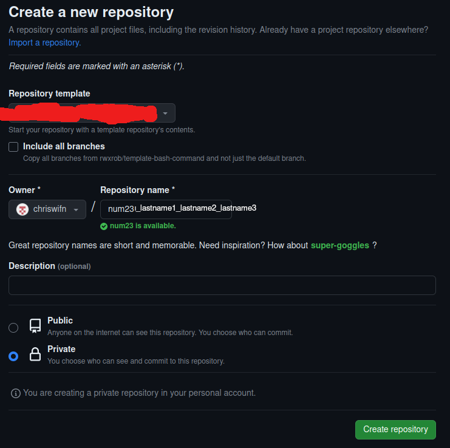

# Numerik Programmieraufgaben WiSe 2023/2024

**🛑 Diese Form der Abgabe gilt erst ab der 2. Programmieraufgabe!**

**🛑 Die erste Abgabe erfolgt wie normal per E-Mail an `progtutor(at)na.uni-tuebingen.de`**

# GitHub account erstellen
Sie muessen einen [GitHub](https://github.com) erstellen, um die Aufgaben abzugeben. Sie werden eine E-Mail Adresse benoetigen. Wenn Sie in der Zukunft Vorteile von **GitHub** wollen, verlinken sie den Account mit ihrer studentischen E-Mail. Das gibt ihnen bspw. kostenlosen Zugriff auf [GitHub Copilot](https://github.com/features/copilot).

# GitHub Desktop installieren/konfigurieren
1. Theoretisch koennen sie jeden `git` Client, oder `git` selbst benutzen.
1. Wenn Sie es sich selber so einfach wie moeglich machen wollen, benutzen sie [GitHub Desktop](https://desktop.github.com/)
1. Einfach dieser [Anleitung](https://docs.github.com/de/desktop/installing-and-authenticating-to-github-desktop/setting-up-github-desktop) folgen.

# Repository anhand des Templates erstellen
Das public template Repository steht noch nicht fest. Weitere Informationen folgen.

Generelle Anleitung:
1. Navigieren zu der public template Repository in ihrem Browser
1. Den Code Reiter oben auswaehlen
1. Unter `Use this template` `Create a new repository` auswaehlen
   
1. Namen auf `num23` setzen, `Private` auswaehlen und mit Create repository bestaetigen
   
   Ignorieren Sie den Namen bei Repository template, der ist nur zur Demonstration hier, der wird spaeter anders heissen. Ich kann das nur nicht selber testen weil ich keine 2 GitHub Accounts habe.
   `rwxrob` hat mit der Numerik nichts zu tun.
1. Repository lokal mit GitHub Desktop `clonen`

# Vorgehen bei den Abgaben
1. In das Verzeichnis eurer GitHub Repos gehen.
1. In den Ordner zur Programmieraufgabe wechseln (`pa2` fuer Programmieraufgabe 2 bspw.)
1. In diesem Unterordner die Dateien erstellen und befuellen (hoffentlich mit der Loesung zur Aufgabe)
1. Uber GitHub Desktop die Dateien zur `Staging Area` hinzufuegen und mit `commit(s)` zur Repository hinzufuegen und anschliessend auf ihren privaten `remote` pushen.
